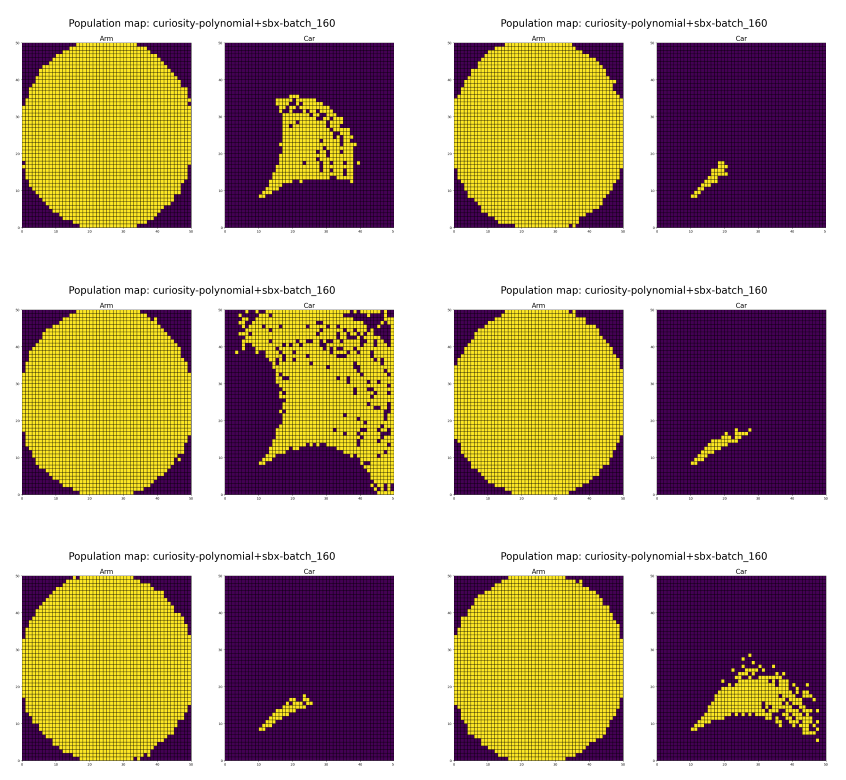

# Racecar Environment for IMGEP and MAP Elites
This repo implements two evolutionary algorithms: Intrinsically Motivated Goal Exploration Process (https://arxiv.org/abs/1708.02190) combined with MAP-Elites (https://arxiv.org/abs/1504.04909). The two algorithms are applied to a complex task where a robot arm moves around an environment and can control a racecar using a gamepad. 

## Typical results
After running the `runner.sh` scripts, we plot the final archive of the evolutionary algorithm with different hyperparameters, the yellow dots indivate positions which the robot has discovered. On the left are the positions the arm itself has discovered how to reach, on the right are the locations it has managed to move the racecar to:


# Typical configuration
```
Configuration:

 px = \
    {
        # more of this -> higher-quality CVT
        "cvt_samples": 25000,
        # we evaluate in batches to parallelize
        "batch_size": 100,
        # proportion of niches to be filled before starting
        "random_init": 0.01,
        # batch for random initialization
        "random_init_batch": 100,
        # when to write results (one generation = one batch)
        "dump_period": 1e4,
        # do we use several cores?
        "parallel": True,
        # do we cache the result of CVT and reuse?
        "cvt_use_cache": True,
        # min/max of parameters
        "min": 0,
        "max": 1,
        # probability of mutating each number in the genotype
        "mutation_prob": 0.2
    }

num evals = 1e7
niches = 15:100:100

regular BD no distractors


polynomial mutation 0.2 prob 
```